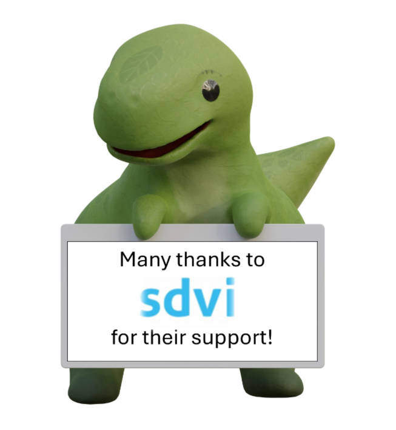

**[SDVI][sdvi]** is one of our wonderful backers and we couldn’t be successful
without them. If you sign up to Rexy's fun **[IBC treasure hunt][ths]** then
you'll have a chance of ***winning a cuddly Rexy!*** The more partners and
backers you visit, the greater chance you'll win on Sunday afternoon in the IBC
[AI Zone][rxydraw]. Sign up at [https://auth.metarex.media/ui/registration][ths].
Instructions on the [treasure hunt page][thp].

Follow {} on [LinkedIn][limrx] to catch a glimpse of Rexy before
the show. She’s shy and only appears in jigsaw form at the moment!

**[SDVI][sdvi]** is an award-winning supplier of cloud-based media supply chain
technology that empowers organisations to optimize content ingest, processing,
packaging, and distribution operations. They bring modern technical approaches
and **[supply chain thinking][rally]** to media operations, backed by many
years of experience in the media and entertainment technology sector.

Be sure to visit the [SDVI][sdvi] booth at IBC 2024, booth number
**[5.G55][booth]**, to see how they are helping media organisations create a
scalable and responsive infrastructure that provides business agility,
operational efficiency and process intelligence.

[#IBC2024](https://www.linkedin.com/search/results/all/?keywords=%23IBC2024)
[#metarex](https://www.linkedin.com/search/results/all/?keywords=%23metarex)
[#rexy](https://www.linkedin.com/search/results/all/?keywords=%23rexy)
[#sdvi](https://www.linkedin.com/search/results/all/?keywords=%23sdvi)
[#mediasupplychain](https://www.linkedin.com/search/results/all/?keywords=%23mediasupplychain)
[#media](https://www.linkedin.com/search/results/all/?keywords=%23media)
[#metadata](https://www.linkedin.com/search/results/all/?keywords=%23metadata)
[#rexytreasurehunt](https://www.linkedin.com/search/results/all/?keywords=%23rexytreasurehunt)
[#dinorexy](https://www.linkedin.com/search/results/all/?keywords=%23dinorexy)

<i class = "linkedin icon"></i>[@SDVI](https://www.linkedin.com/company/sdvi-corporation/)
<i class = "linkedin icon"></i>[@metarex][limrx]
<i class = "linkedin icon"></i>[Rexy at IBC][lirxy]

[sdvi]:  https://sdvi.com
[rally]: https://sdvi.com/platform/
[booth]: https://ibc2024.mapyourshow.com/8_0/floorplan/?hallID=K&selectedBooth=5.G55

[limrx]:   https://uk.linkedin.com/company/metarex-media
[lirxy]:   https://www.linkedin.com/search/results/all/?keywords=%23ibc2024%20%23metarex%20%23rexy
[rxydraw]: https://ibc2024.mapyourshow.com/8_0/floorplan/?st=keyword&hallID=J&sv=V-NOVA&selectedBooth=14.AI03
[ths]:     https://auth.metarex.media/ui/registration
[thp]:     /project/treasure-hunt/
