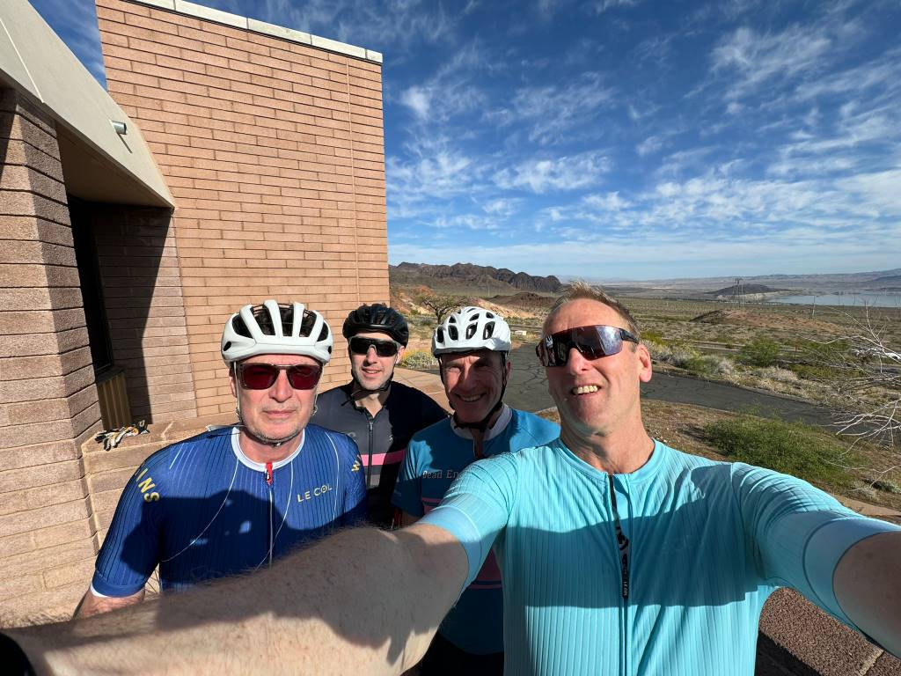
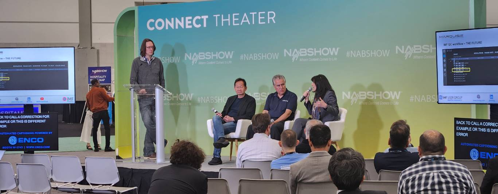


<!-- markdownlint-disable MD025 -->

## Thank you to all our visitors and new Backer at NAB 2024!

The [award winning][0] {} project lit many mental light bulbs at this years NAB. We showed 12 wildly different workflow examples that used a single, service-oriented {} codebase.  Most people understood that self describing metadata allows simple low code and no code workflows - even if the metadata you're using was unknown when the workflow started.  Interestingly, The [Green Software Foundation](https://podcast.greensoftware.foundation/) podcast from 2024-04-04 explained how low code and no code workflows are often lower carbon than hosts of dedicated workflows - another plus point for {}.

The demos will appear online on our website in the next couple of weeks for anyone to play with. We'd particularly like to thank all the existing
[Backers](/backers) that made NAB 2024 possible, with a special shout out to the folks at [Signiant](https://signiant.com) who hosted us so wonderfully.

We have around **_20_** new backers as a result of NAB 2024 and we'll be
thanking them individually over the coming weeks. Look out for more metadata workflows and updates to our [GitHub](https://github.com/metarex-media) repo as we tidy up all the pre-NAB work and give it to you for free.

See you all at MPTS in London 15th - 16th May 2024!

[0]: /blog/2024/03/06/2024-03-06-rnf-wins-best-accelerator/



Hoover Dam Bike Ride

IMF QC Panel

