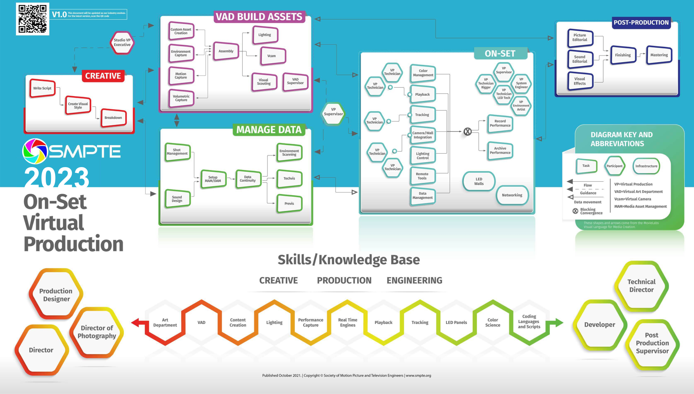

##  On Set Virtual Production

The [award winning][0], philanthropic, non-profit  Project makes metadata flow. In the rapidly changing
world of On Set Virtual Production we already have too many incompatible formats and protocols and the poor setup and
data wrangling crew perform miracles on every shoot do get things stable and keep them stable until it's time for tear
down.

Play the [video] from the [SMPTE RIS OSVP][1] experts and hear their views on the debate between Standards & Products.
We believe, like many of the points raised in the video, that products will lead the way and standards will eventually
follow.

[0]: /blog/2024/03/06/2024-03-06-rnf-wins-best-accelerator/
[1]: https://www.smpte.org/rapid-industry-solutions/on-set-virtual-production
[video]:  https://www.youtube.com/embed/r9Da_f612YY?si=cWD_sERLjZHI9Wxo&amp;start=381



### But why is  useful?

Our  initiative is just plumbing to help the product innovators concentrate on great story telling
products, confident that the metadata they rely upon will get to where it's needed quickly, accurately and in a way that
can be transformed easily depending on the use-case they haven't imagined yet.

The  container wraps up _**any**_  metadata and then the container is put on a network or storage system.
We now have one, unified, free mechanism for handling _any_ metadata. This allows single way to get a clear definition
of **what** the metadata is, what **version** of the metadata was used, what is its **specification**, can it be
automatically **QC**'d with a **schema** and are there any **services** available to be sure it's right
before it's too late?





As the SMPTE Rapid Industry Solutions On Set Virtual Production project enters
its publication phase and we start to see harmonized metadata schemas and new
protocols appearing, there will be a need to manage the transition to this new
world.  aims to provide the plumbing to allow multiple variants
of the same metadata values to be managed on a single network without insanity
taking over.



  



<!-- markdownlint-disable MD026 -->

We'll be showing [][f] use-case examples for Virtual Production at NAB this year. You will be able to play
with the examples online - even if you're not at the show.

[f]: https://github.com/metarex-media





## So who benefits from this?

 enables a generic metadata supply chain with the rigour that we are starting to develop with video and audio.

* **Content Creators** can now track and convert metadata from camera to screen
* **Product Vendors** can now integrate more metadata types for less initial
  and significantly less engineering costs
* **Data Warehousing** can benefit by integrating disparate timeline metadata
  with the same ease as static metadata
* **Metadata Producers** can benefit with greater access to more networks and
  file formats with no extra effort
* **Metadata Consumers** can benefit by simultaneously managing and using
  multiple transformed variants of source metadata without increasing costs
* **The Industry** can benefit by spending the money saved by 
  on creating rich, metadata driven workflows instead of just leaving the
  metadata on the floor
* **The planet** might benefit if we spent microWatts of energy remembering the source metadata rather than spending kiloWatts of energy guessing what was lost by using an AI algorithm

If you or your company have a question about MetaRex, metadata or want to get involved with the  **Project** [contact] us.



