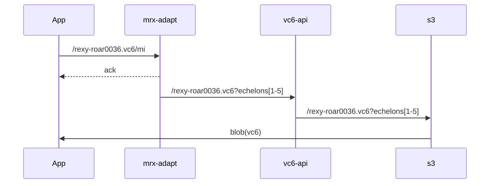

<!-- markdownlint-disable MD033 -->


#### We're proposing a simple paradigm

* Store your content at rest in full resolution
* Use an API to retrieve the resolution you need
* only ever link to the full res content
* Iterate your AI training
  * lowest res for all content
  * mid-res for higher-value content
  * highest res for top-tier content



The PoC works like this:


1. Ingest - nothing special - just store [VC-6][vc6], just like any other media
   asset.
2. Define a metadata document identifying the properties of each available
   resolution in the stored content<br>(e.g.
   `lo`= low resolution asset at 240 x 135 pixel Rec.709 SDR).
3. Define a simple API adapter to convert simple fetching operations in
   existing tools (e.g. AI segmentation) to meet [Time Addressable Media][tam]
   principles. Ideally, this should work with tools like `aws:rekognition` or
   `THEOplayer` or `shaka-player` or `video.js`)
4. BASIC - high volume AI pass
   * choose the lowest practical resolution and scan every asset for
     audio-visual-engagement metrics
   * use a human assisted AI decision tree to filter the list to a reasonable
     number of feeds for editorial review // 2nd pass metrics generation
5. MID - full scan of candidate feeds / clips
   * increase the resolution & re-scan every asset with higher fidelity
     settings to retrieve better metrics / transcripts / Quality data on each
     clip.
6. FULL - clips selected for air
   * Extra work for compliance / editorial / graphics passes on highest
     required resolution.

The important part of this PoC is that no proxies are generated. The content
exists as a single asset that's programmatically retrieved from generic storage
that has been optimised for the user's workflow needs.

[tam]: https://downloads.bbc.co.uk/rd/pubs/whp/whp-pdf-files/WHP421.pdf
[vc6]: https://www.v-nova.com/vc-6-higher-quality-at-lower-bitrates/vc6-encoding-and-decoding-sdk/



## The processing in more detail

### 1. Ingest<a id="1"></a>

For this explanation, we'll assume that every ingested frame can be identified
with a uri like this:

```javascript
// simple declarative statement in some programming language:
uri = "mode:location/asset.vc6?api-specific-selectors"
```

### 2. Hierarchy properties metadata<a id="2"></a>

An example document could be really simple JSON:

```javascript
{
   "metarexId": "0195477a-e716-709f-a18f-15ab454471ec",
   "ladder":[
     {"w":3840, "h":2160, "name":"4k"},
     {"w":1920, "h":1080, "name":"HD", "alias": "hi"},
     {"w":960,  "h":540,  "name":"qHD"},
     {"w":480,  "h":270,  "name":"q2D", "alias": "mi"},
     {"w":240,  "h":135,  "name":"q3D", "alias": "lo"}
   ]
}
```

This example assumes secret information that the array is ordered from highest
bitrate/compute load to lowest bitrate/compute load, pixels are square and each
layer has the same colorimetry. Production examples may be more complex and may
utilise more features of the underlying [VC-6][vc6] codec.

For metarex to provide some automatic functionality, it needs a schema to
validate this new document. Here's one that was made in about 50 seconds with
an [online tool][01] and registered on the metarex.media register.

```javascript
{
  "$schema": "https://json-schema.org/draft/2019-09/schema",
  "$id": "http://metarex.media/reg/0195477a-e716-709f-a18f-15ab454471ec/aicar",
  "type": "array",
  "default": [],
  "title": "Metarex AICAR ladder schema",
  "items": {
     "type": "object",
     "title": "A Schema",
     "required": ["w","h","name"],
     "properties": {
       "w": {
         "type": "integer",
         "title": "width",
         "examples": [3840,1920,960,480,240]
       },
       "h": {
           "type": "integer",
           "title": "height",
           "examples": [2160,1080,540,270,135]
       },
       "name": {
         "type": "string",
         "title": "name",
         "examples": ["4k","HD","qHD","q2D","q3D"]
       },
       "alias": {
         "type": "string",
         "title": "alias",
         "examples": ["hi","mi","lo"]
       }
     },
     "example": [
        {"w": 3840,"h": 2160,"name": "4k"},
        {"w": 1920,"h": 1080,"name": "HD", "alias": "hi"},
        {"w": 960,"h": 540,"name": "qHD", "alias": "mi"},
        {"w": 480,"h": 270,"name": "q2D"},
        {"w": 240,"h": 135,"name": "q3D", "alias": "lo"}
     ]
  }
}
```

### 3. Make a simple TAM API interface

The diagram shows the  footprint. This is where we use the
 principles to convert the simple API into a more sophisticated
API that does the actual object fetching depending on the properties required.
A sample API definition is available on API Hub
[/apis/Mr-MXF/AICAR-demo/1.0.0#/][03]/

It takes a request of the form:

```url
https://mrmxf.com/a/mrx/aicar/get/asset/rexy-roar0036.vc6/mi
```

and returns a vc6 frame of the appropriate resolution that's extracted from
the stored content stream.

For this proof of concept it's trivial, but most importantly it's extensible to
take into account capabilities of good professional codecs:

* AssetId - anything from filenames to ID chains
* Resolutions - from proxy to 8k
* Dynamic Range - a selector for the required dynamic range characteristics
* Start - the start point in the asset (time offset, frame offset etc)
* Duration - Retrieve multiple units of data to prevent network chatter
* Colorimetry - What color space should the retrieved asset be in.

Done properly, such an interface can be beneficial:

* simplification an re-use of workflows through configuration
* optimise store/compute decisions when requests use profiling metadata
* migration from many-version workflows to primary version + cache to simplify
  asset storage and future de-duplication headaches

The metarex API adapter looks a bit like this:



### 4. BASIC - put it all together



The BASIC flow needs to be low cost, yet "good-enough" to triage all the
inputs. The simplified node-red workflow about shows a simplistic demo that
can run in a browser on a website.

A fuller demo would use industry vendor solutions for workflow, storage, AI.

## To make this a reality for everyone…

We need to complete our `mrx-worker` module. This code integrates all the
necessary building blocks of metarex into a single repo that allows several
different operating modes

1. Stand alone executable (intel, arm, Win, Mac, Linux)
2. Embedded network service for use inside a product or cluster ([Figure
   4](#fig-4))
3. Authenticated network service for use in a mixed security environment

<a id="fig-4"></a>{{ fo
   id = "fig-4"
   t = "image"
   src = "mrx-worker2.svg"
   srcClass = "ui large centered image"
   alt = "MetaRex Concept"
   text = "mrx-worker embedded services"
   header = "Figure 4"
/>}}

### Status 2025-02-10

Most of the components exist to trial this workflow:

* a readable online register
* an envelope specification
* golang code for inserting and extracting documents from the envelope
* a specification for service representation in the register
* a [prototype register](https://metarex.media/reg)

We are looking for supporters to turn this into a real Proof Of Concept in
two phases:

1. Q1/Q2 2025 - optimise the {} software for a vendors sending and
   listening equipment. This will involve creating, registering and testing
   a proprietary document format in a simulated or real network.
2. Deploying the test system at a real event.

We estimate about 5 weeks of engineering for each phase.

[01]:  https://jsonschema.net/
[03]:  https://app.swaggerhub.com/apis/Mr-MXF/AICAR-demo/1.0.0#/
[tam]: https://downloads.bbc.co.uk/rd/pubs/whp/whp-pdf-files/WHP421.pdf
[vc6]: https://www.v-nova.com/vc-6-higher-quality-at-lower-bitrates/vc6-encoding-and-decoding-sdk/