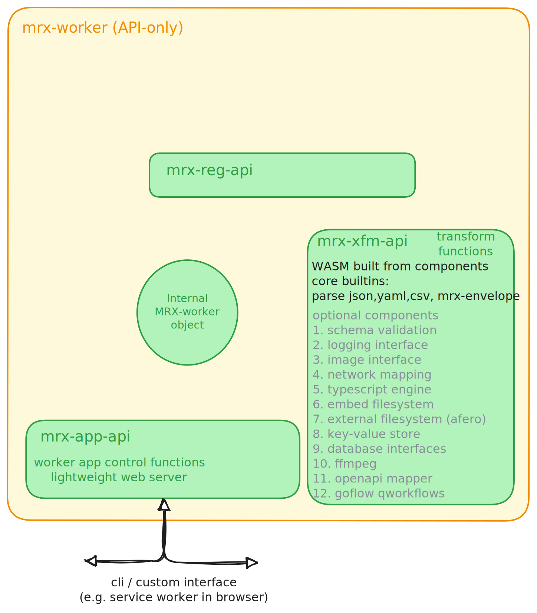
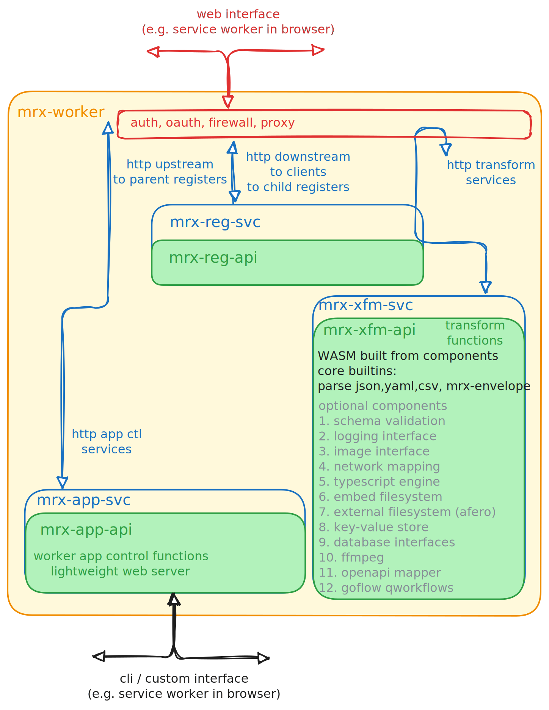

{}

We're proposing a simple paradigm:

* Store your content at rest in full resolution
* Use an API to retrieve the resolution you need
* only ever link to the full res content
* Iterate your AI training
  * lowest res for all content
  * mid-res for higher-value content
  * highest res for top-tier content

### Status 2025-02-10

Most of the components exist to trial this workflow:

* a readable online register
* an envelope specification
* golang code for inserting and extracting documents from the envelope
* a specification for service representation in the register
* a [prototype register](https://metarex.media/reg)

We are looking for supporters to turn this into a real Proof Of Concept in
two phases:

1. Q1/Q2 2025 - optimise the {} software for a vendors sending and
   listening equipment. This will involve creating, registering and testing
   a proprietary document format in a simulated or real network.
2. Deploying the test system at a real event.

We estimate about 5 weeks of engineering for each phase.
