<!-- markdownlint-disable MD033 -->
<i class="chevron circle right icon"></i>|
[C3]({}) |
[c3-tool]({}) |
[testing]({}) |

#### We're proposing a simple paradigm 

```mermaid
flowchart TD
%% Nodes
    A("🛠️ Spawn a Cloud System")
    D["▶️ Run in different modes"]
    B[("🖥️ Model in mrx-COST")]
    C("🕵🏻 Trace with Open Telemetry (OTEL)")
    E("📏 Apply OTEL data to metarex model")
    F("🗜️ normalize AWS pricing ⇒ mrx-COST")
    G("💰 Get real-time costs")

%% Edge connections between nodes
    A --> B 
    B -.-> E
    A --> C
    C -.-> D
    A --> D
    D --> E
    F -.-> B
    E ==> G

%% Individual node styling. Try the visual editor toolbar for easier styling!
    style B color:#000, fill:#b5d690, stroke:#4F702A
    style C color:#000, fill:#b5d690, stroke:#4F702A
    style G color:#FFFFFF, stroke:#00C853, fill:#00C853

%% You can add notes with two "%" signs in a row!
```

* A minimal, cloud-independent model of the major cloud cost points
  * e.g. EC2 type
  * NAT Gateway boundaries for traffic
  * storage types
  * dB
* A normalization tool to import real-time pricing data to the model
* A normalization tool to import real-time energy mix data to the model
* A `middleware` approach to integrate [`opentelemetry.io`](https://opentelemetry.io)
* A [grafana-friendly](https://grafana.com/) output format

We are looking for supporters to turn this into a real Proof Of Concept in
two phases:

1. Q3/Q4 2025 - optimise the {} worker and build a normalizer for
   AWS to be demonstrated at IBC 2025.
2. Q1/Q2 Deploying the test system in a real environment and improve the model.

We estimate about 10 weeks of engineering for each phase and are looking for
collaborators who might find 1 or more weeks of engineering @ £1000/wk.

#### Try it out 

The [mrx-c3-tool repo][c3] is a self contained test environment for comparing the costs of workflow on different cloud
platforms. You can download it and run it with your own cloud accounts.

The links in this table may change:

| 2025/08/04 08:32:51 🌐 | 🔗 Retrieving service endpoints                       |
| ---------------------- | ------------------------------------------------------ |
|🌍 Externally Accessible Services: | |
|  ✅ applications/nginx-demo| http://a389fa89ded544c1ebb9622045185c2d-1725007207.us-east-1.elb.amazonaws.com (http)  |
|  ✅ auth-system/pocketbase-simple| http://af4c4a45eb3b3419990e35d61b12758f-954593140.us-east-1.elb.amazonaws.com:8080 (http)  |
|  ✅ caddy-system/caddy-proxy| http://ada3362b519d245569f649fe93e6d609-407873111.us-east-1.elb.amazonaws.com (http)  |
| 
 | 
 |
|🏠 Internal Services (via port-forward)|  |
|  🏠 applications/hello-app| kubectl port-forward -n applications svc/hello-app 8080:8080  |
|                                                 | http://localhost:8080 (http)  |
|  🏠 applications/opentsg-app| kubectl port-forward -n applications svc/opentsg-app 8080:8080  |
|                                                 | http://localhost:8080 (http)  |
|  🏠 auth-system/pocketbase  | kubectl port-forward -n auth-system svc/pocketbase 8080:8080  |
|                                                 | http://localhost:8080 (http)  |
|  🏠 auth-system/pocketbase-internal | kubectl port-forward -n auth-system svc/pocketbase-internal 8080:8080  |
|                                                 | http://localhost:8080 (http)  |
|  🏠 caddy-system/caddy | kubectl port-forward -n caddy-system svc/caddy 80:80  |
|                                                 | http://localhost:80 (http)  |
|  🏠 caddy-system/caddy| kubectl port-forward -n caddy-system svc/caddy 9180:9180  |
|                                                 | http://localhost:9180 (metrics)  |
|🔒 Restricted Access Services |  |
|🔒 database/mariadb         | none (database/internal)  |
|  🔒 default/kubernetes       | none (database/internal)  |
|💡 Port-forward usage         | kubectl port-forward -n <namespace> svc/<service-name> <local-port>:<service-port>  |

**Current status:**

* Command line bash script control
  * `bash c3.sh setup` check for prerequisite tooling, tokens and authentication
  * `bash c3.sh terraform ga dev` terraform a group A Amazon EKS cluster running the pod under test
  * `bash c3.sh test ga dev` run tests on the cluster to ensure it meets the desired test conditions
  * `bash c3.sh deploy ga dev` deploy the applications and pod under test
  * `bash c3.sh test ga dev` run tests on the cluster to ensure a consistent state to allow a testrun
  * `bash c3.sh testrun ga dev` start a testrun and log data to the database
  * `bash c3.sh destroy ga dev` detroy applications and remove all traces of the EKS cluster
* Test groups created:
  * `ga` Amazon EKS
  * `gr` Rancher K3s running on Amazon EC2
* Cluster types:
  * `dev` ephemeral smaller/less redundant clusters to get the framework parameters right
  * `test` ephemeral smaller/less redundant clusters to get the test command & Grafana graphs working
  * `stage` ephemeral full size/security/redundant clusters approve test methodology
  * `prod` smaller/less redundant clusters to get the framework parameters right
* Configuration
  * `c3.yaml` - base configuration of groups, tags, test durations, source content etcc
  * `common-presets` - data applying to all tests e.g. amazon account / azure account etc.
  * `{GROUP}` - data applying to {GROUP} Only - e.g. `ga`
  * `{GROUP}-{MODE}` - data applying to {GROUP}-{MODE} Only - e.g. `ga-dev`#
* Analysis
  * All resources are uniquely tagged
    * to separate infrastructure costs from tests costs
    * to separate costs from different compute / reqource sizes

[c3]: https://github.com/metarex-media/mrx-c3-tool
