<!-- markdownlint-disable MD033 -->

```mermaid
flowchart TD
%% Nodes
    A("🛠️ Build a Cloud System")
    D["▶️ Run in different modes"]
    B[("🖥️ Model in mrx-COST")]
    C("🕵🏻 Trace with Open Telemetry (OTEL)")
    E("📏 Apply OTEL data to metarex model")
    F("🗜️ normalize AWS pricing ⇒ mrx-COST")
    G("💰 Get real-time costs")

%% Edge connections between nodes
    A --> B 
    B -.-> E
    A --> C
    C -.-> D
    A --> D
    D --> E
    F -.-> B
    E ==> G

%% Individual node styling. Try the visual editor toolbar for easier styling!
    style B color:#000, fill:#b5d690, stroke:#4F702A
    style C color:#000, fill:#b5d690, stroke:#4F702A
    style G color:#FFFFFF, stroke:#00C853, fill:#00C853

%% You can add notes with two "%" signs in a row!
```

#### We're proposing a simple paradigm

* A minimal, cloud-independent model of the major cloud cost points
  * e.g. EC2 type
  * NAT Gateway boundaries for traffic
  * storage types
  * dB
* A normalization tool to import real-time pricing data to the model
* A normalization tool to import real-time energy mix data to the model
* A `middleware` approach to integrate [`opentelemetry.io`](https://opentelemetry.io)
* A [grafana-friendly](https://grafana.com/) output format

We are looking for supporters to turn this into a real Proof Of Concept in
two phases:

1. Q3/Q4 2025 - optimise the {} worker and build a normalizer for
   AWS to be demonstrated at IBC 2025.
2. Q1/Q2 Deploying the test system in a real environment and improve the model.

We estimate about 10 weeks of engineering for each phase and are looking for
collaborators who might find 1 or more weeks of engineering @ £1000/wk.
