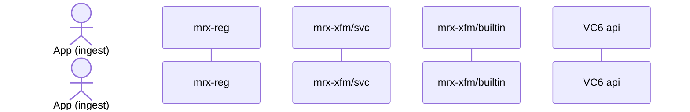

The components of the workflow are:

* `App`
* `mrx-reg`
* `mrx-xfm/svc`
* `mrx-xfm/builtin`

```mermaid
sequenceDiagram
  actor       A as App (ingest)
  participant R as mrx-reg
  participant S as mrx-xfm/svc
  participant B as mrx-xfm/builtin
  participant V as VC6 api


```
