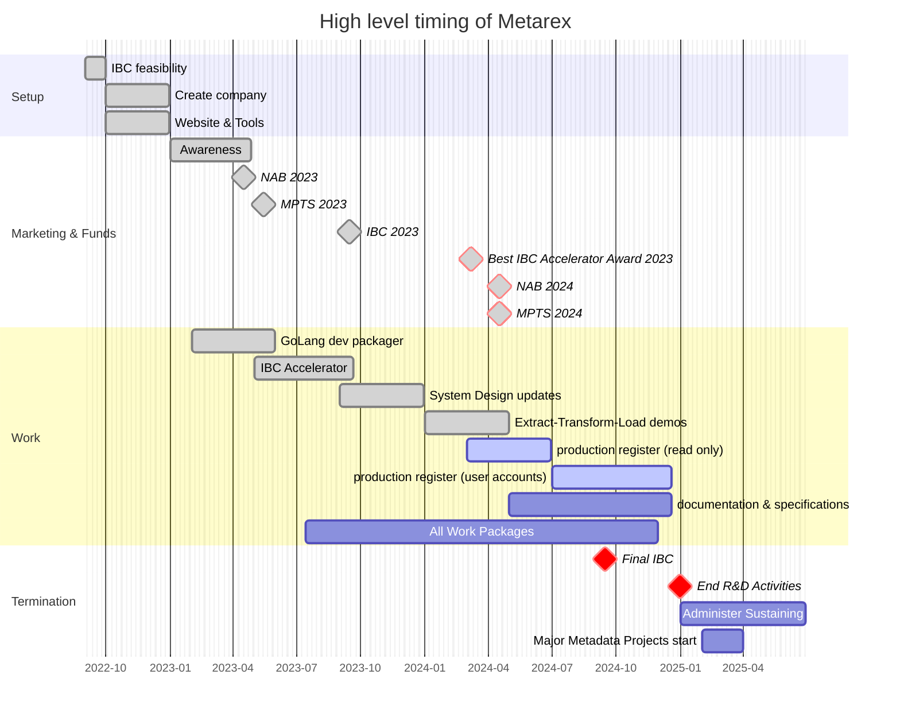

---

title:       "Status"
linkTitle:   "Status"
weight:      50
type:        docs
description: Current Status.
tags: ["status"]
---



{} is looking for more [backers] to create a financial reserve
from which we can give out grants to engineering teams to create the Open
Source that we need to enable free tooling for all. Please make a small
financial or engineering contribution if a working global media meta data
ecosystem is of interest to you or your company.

{}

[backers]: /backers